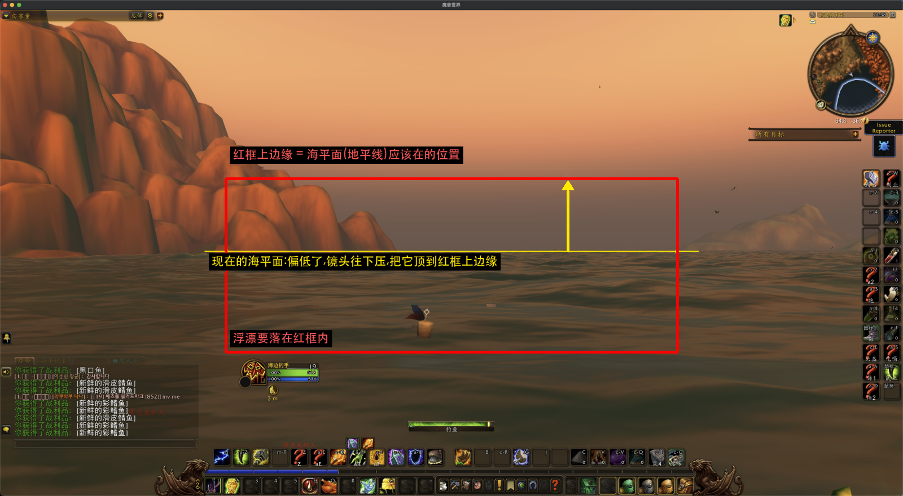

# wowfishtool

魔兽世界自动钓鱼脚本(Python)。抛竿后截图、模板匹配找鱼漂位置、移动鼠标;监听系统音频,
听到上钩声就自动右键拉杆。

> macOS 是实测平台。Windows 部分标 ⚠️ 的地方只是按原理写的,没有在真实 Windows 设备上跑过,
> 遇到问题欢迎反馈。

## 安装

### 1. 环境准备

Python 3.9+,推荐 3.11~3.13。

**macOS**

```bash
python3 -m venv .venv
source .venv/bin/activate
```

**Windows**(没装过 Python/Git,推荐只装 PyCharm 一个东西):

```text
1. 装 PyCharm Community(免费):https://www.jetbrains.com/pycharm/download/

2. 拿代码:PyCharm 欢迎界面 → Get from VCS → 贴项目地址 → Clone
   备用方案:GitHub 页面 → Code → Download ZIP → 解压 → PyCharm File → Open 选中该文件夹

3. 装 Python:File → Settings → Project → Python Interpreter → Add Interpreter →
   Add Local Interpreter → Virtualenv Environment → Base interpreter 选 3.11 或 3.12

4. 后面所有"打开终端敲命令"的步骤,都用 PyCharm 底部的"终端"面板(不是"Python 控制台")
```

### 2. 系统权限

**macOS**:

```text
系统设置 → 隐私与安全性 → 辅助功能 → 勾选"终端"/"PyCharm"
系统设置 → 隐私与安全性 → 屏幕录制 → 勾选"终端"/"PyCharm"
改完重启终端/IDE
```

**Windows**:

```text
终端/IDE 和 WoW 都以管理员身份运行，或者两边都不用管理员权限——不要一边有一边没有
```

### 3. 配置音频回环设备(用来"听"上钩声音)

先调游戏内声音设置:

```text
声音 → 音效音量调大于 0
声音 → 音乐/环境声音调低或关闭
声音 → 关闭"后台/非焦点窗口时降低音量"
```

**macOS:装 [BlackHole](https://github.com/ExistentialAudio/BlackHole)**

```bash
brew install blackhole-2ch
```

```text
音频 MIDI 设置 → "+" → 新建"多输出设备" → 勾选 BlackHole 2ch + 你平时用的输出设备
系统设置 → 声音 → 输出 → 选中这个多输出设备
魔兽世界 → 声音设置 → 确认输出没被锁定到别的设备
```

**Windows:[VB-Audio Virtual Cable](https://vb-audio.com/Cable/)**(BlackHole 不支持 Windows)

```text
以管理员身份运行 VBCABLE_Setup_x64.exe → 重启电脑
Windows 设置 → 声音 → 输出设备 → 选 "CABLE Input"
  想同时自己听到：控制面板 → CABLE Input → 侦听 → 勾选"通过此设备播放" → 指向耳机/音箱
魔兽世界 → 声音设置 → 输出也选 "CABLE Input"
```

配置完用 `tests/test_listen.py` 实测能不能收到游戏声音、峰值均值多少,再照实际数值调
`fishing.py` 里 `listen()` 的 `threshold`。

### 4. 安装 Python 依赖

#### 4.1 macOS:先装系统的 portaudio(Windows 跳过这步)

```bash
brew install portaudio
```

#### 4.2 安装依赖(macOS / Windows 都要)

```bash
pip install -r requirements.txt
```

## 使用

### 用 PyCharm 运行(Windows)

```text
File → Open → 选中项目文件夹（包含 fishing.py 的那一层）
File → Settings → Project → Python Interpreter → 确认是项目里的 .venv
PyCharm 底部"终端"面板 → pip install -r requirements.txt
左侧项目树双击 fishing.py → 点行号左边的绿色三角形运行

# 运行面板打印出 "Press F10 to start fishing, F11 to stop" 后，切回游戏窗口按 F10/F11
```

macOS / 习惯命令行的可以跳过这节。

### 命令行运行(通用 / macOS)

1. 画质调到 4 档左右,关掉水面反射
2. 镜头拉到最近,拉到看不见自己人物为止
3. 钓鱼快捷键放快捷栏第 1 格(对应 `fishing.py` 里的 `CAST_KEY`)
4. 运行:

   ```bash
   python fishing.py
   ```

5. 切回游戏窗口,按 **F10** 开始自动钓鱼,**F11** 停止

### 抛竿落点参考

抛竿离角色本体太近,落点可能落进屏幕下方两块被强制排除识别的区域(默认角色状态框,以及
现代布局在右下角的同款副本,大致宽度 26%~36%、高度 72%~80%,和宽度 62%~76%、高度 71%~83%)——这两块区域
不管当时实际有没有状态框都会被判定"不可能是鱼漂",落进去就永远识别不到。抛竿离角色本体
远一点,让落点落在下图红框内。同时调整视角(镜头往下压),让海平面(地平线)落在红框的上边缘:识别的搜索范围是画面宽度 25%~75%、高度 36%~80%(红框画到 71% 为止,是为了避开下方的 UI 排除区),
海平面落在红框中间说明镜头仰得太高,红框里混进了天空和山崖,既容易误判,也浪费了水面范围。



### 使用注意

- **别人的浮漂:** 识别只看画面里哪个位置最像浮漂,分不出是不是你自己的。人多的钓点里,别的玩家的浮漂
  也会出现在搜索范围内,脚本可能会把鼠标移到别人的浮漂上,点它是捞不到鱼的(表现为一直听到咬钩声
  却抓不到鱼,或者一直"没找到"后放弃)。请尽量选没有其他玩家钓鱼的水域。
- **抓到的数量只是参考:** 控制台里的 `caught N` 数的是"听到咬钩声并点击了一次"的次数,不等于真的捡到了
  N 条鱼。点错位置时同样会被计数。想知道实际收获,请对比背包里的数量。
- **窗口大小:** 保持游戏窗口正常大小效果最好。窗口缩小后会自动放大截图再识别,但没有全尺寸时可靠。

### 连续没抓到鱼时

开始钓鱼时脚本默认你已经在游戏世界里,直接进入钓鱼流程,不会每次抛竿都去检查是不是掉线。
连续 `MAX_CONSECUTIVE_MISSES`(默认 10)次没抓到鱼(找不到浮漂,或者找到了但没听到咬钩),就说明有问题,
先判断是不是掉线了:截一张图,看是不是**登录界面或角色选择界面**(断线、被顶号、被服务器踢、账号被冻结,
最后都是同一个页面,只是弹窗文案不同;再按一次回车就到了角色选择)。判断依据是页面上固定的东西,不看弹窗文字:
每个页面认它自己底部或左上角的两个固定控件,**两个都找到才算**:经典旧世登录页是左上角的游戏标志加右下角的"退出"按钮,
测试服登录页是底部的暴雪徽标加"退出"按钮,角色选择页是"进入魔兽世界"按钮加"创建角色"按钮。不依赖只有部分客户端才有的标志。
(模板在 `var/login_screen_*.png`,逻辑在 `login_screen.py`)。

- **不在这两个页面:** 说明没有断线(还连着游戏),回车只会打开聊天框,所以直接停止,回到"按 F10 重新开始"的状态。
- **在这两个页面:** 尝试重新进入游戏:按一次回车,等几秒,再看一次画面,还在这两个页面就再按一次(最多 6 次,
  等待时间是 `RECOVERY_WAITS`,依次为 2、10、18、10、10、10 秒:关弹窗、登录页、进游戏的加载画面,后三次给网络慢的情况)。
  画面不再是这两个页面后,隔 5 秒再确认一次(加载画面也不是这两个页面),确认后立刻停止按回车,继续钓鱼——
  多按一次回车在游戏里只会打开聊天框。6 次都按完还在这两个页面就直接停止,不再白抛 10 次。
  恢复成功后再连续 10 次没抓到,同样停止。细节见 `fishing.py` 里 `try_recover_from_disconnect()` 的注释。

抓到一条鱼,计数和恢复机会都清零。

### 自动上鱼饵(可选)

游戏里做个宏绑快捷键 **2**:

```
/use 鱼饵的名字
/use 16
```

脚本开始钓鱼时按一次 `2`,之后每隔 `BAIT_REAPPLY_INTERVAL_SECONDS`(默认 10 分钟多)自动
再按一次。快捷键不是 2 的话改 `fishing.py` 里的 `BAIT_KEY`。

### 调试模式

`float_detector.py` 里 `DEBUG_SNAPSHOTS` 默认 `False`。改成 `True` 后会把识别失败的截图
自动存到 `debug/`(已在 `.gitignore` 里):

- 完全没找到鱼漂 → `debug/notfound_<时间戳>.png`
- 找到了鱼漂但没找到底座颜色、点击点退化成兜底位置(该模板自己的底座在框里的位置;底座太小定位不了的模板用框内 (0.5, 0.65) 处)→ `debug/fallback_<时间戳>.png`(带绿框+红点标注,图上还写着证据类型和分数)
- 找到了、点击点也在底座颜色上,但**没有第二类独立证据印证**(低置信度)→ `debug/lowconf_<时间戳>.png`。
  颜色门控、底座颜色、模板一致这三类证据里,真浮漂通常有两类以上指向同一个位置,误判几乎都只有一类,
  所以低置信度的判断最值得事后看一眼;控制台的 `Matched …` 那行末尾也会写 `corroborated by …`
  或 `NOT corroborated by any other evidence`。

- 抛竿没找到时 `fishing.py` 还会存 `debug/notfound_*.png`,连续失败触发重连恢复时存 `debug/recovery_*.png`。
- 开启后 `find_float()` 还会逐步打印以 `[float] ` 开头的过程日志,方便看某次识别为什么错:
  是否缩放截图 → 截图和搜索区域大小 → UI 排除框 → 两类颜色证据(相对饱和度门控的水面基线、阈值、
  像素数、丢掉的大块;底座颜色范围命中的像素数)→ 每个模板的形状分数,以及被 UI 或纹理下限排除掉的
  最佳位置、分别带颜色门控和带底座颜色时的分数 → 几个模板是否一致 → 最终选哪类证据的哪个匹配(门控没找到时依次改用
  含底座颜色的窗口、模板一致的窗口)→ 点击点是怎么定的(底座颜色质心,或退化成兜底位置及原因)→ 最终坐标。没找到时会
  说明是哪一步没过。代码里 `find_float_detailed()` 还会返回决定这次结果的证据类型和分数。

调试完记得改回 `False`。

### 补一个新的鱼漂模板

`var/` 目录下的模板不一定适用于所有天气/水域/光照。识别不准时可以自己补一张:

1. 正常钓一竿,截图会存到 `var/fishing_session.png`(每次覆盖,想保留就手动复制)
2. 用截图工具把鱼漂本体单独裁出来(参考 `var/fishing_float_1.png` 的裁法)
3. 存成 `var/fishing_float_<下一个数字>.png`
4. 重新跑,不用改代码,`find_float()` 会自动纳入比较

补模板会影响"模板一致"这类证据:参与匹配的模板越多,要求一致的模板数也越多(至少 3 个,且不少于总数的
40%),所以补到 10 个模板时需要 4 个一致。模板太少(少于 5 个)时这类证据基本触发不了,建议保持 6~10 个
互相差别比较大的模板(不同光照、不同距离、不同水面),不要塞很多几乎一样的裁图。

## 运行测试

```bash
pytest
```

`tests/test_find_float.py`、`tests/test_audio_listener.py` 是自动化回归测试,不需要开游戏或
真实麦克风,改动识别/音频逻辑后应该先跑一遍。

`tests/test_click.py`、`tests/test_listen.py` 是需要人工确认结果的手动诊断脚本,当成普通
Python 脚本运行(`python tests/test_click.py`),不是 pytest 用例:

- `test_click.py`:验证模拟右键点击能不能传到别的窗口,主要排查 macOS 辅助功能权限
- `test_listen.py`:验证音频回环设备能不能收到游戏声音,配置 BlackHole/VB-Cable 后先跑这个

## 故障排查

**脚本运行了,但游戏里鼠标/键盘毫无反应**

- macOS:权限给的是"终端"还是"PyCharm"要跟实际运行 Python 的程序一致;改完权限必须重启
  终端/IDE 才生效。不确定权限有没有生效,跑 `tests/test_click.py` 单独验证,不用开游戏。
- Windows:如果 WoW 以管理员身份运行,终端/IDE 也必须以管理员身份运行,否则 Windows UIPI
  会静默丢弃低权限进程发给高权限窗口的输入——脚本自己一切正常,游戏就是没反应。两边权限
  必须一致,不要一边有一边没有。

**声音配置好了,脚本却一直"没听到咬钩"**

- 检查游戏"后台/非焦点窗口时降低音量"选项有没有关——一旦触发,游戏会把音量压得很低甚至
  静音,回环设备录到的上钩声音也会跟着变小到过不了 threshold,但看起来一切正常。Discord
  等软件的"检测到别人说话就压低其他程序音量"选项同理要关。
- Windows 上如果除 VB-Cable 外还装过其他虚拟声卡(VoiceMeeter 等),系统里会有好几个名字都
  带 "CABLE" 的录音设备,脚本按设备编号自动挑第一个匹配的,容易挑错——只保留 VB-Cable 一个。
- `audio_listener.py` 默认按系统类型找名字带 "blackhole"(macOS)或 "cable"(Windows)的
  输入设备;如果你的设备名不带这几个字,把 `LOOPBACK_NAME_HINT` 改成能匹配到的关键字。

**`pip install` 装 `pyaudio` 报错**(如 "Microsoft Visual C++ 14.0 or greater is required")

说明没有匹配你 Python 版本的现成 wheel:

```text
python -m pip install --upgrade pip
python --version   # 去 https://pypi.org/project/PyAudio/#files 确认有没有对应版本的 .whl
                    # 没有的话换一个稍旧的解释器版本（比如 3.11/3.12）重建虚拟环境
pip install -r requirements.txt
```

**IDE 里运行报 `ModuleNotFoundError`**

十有八九是"装的地方"和"跑的地方"不是同一个 Python 环境——检查 IDE 运行配置选的解释器路径
和 `pip install` 时激活的是不是同一个 `.venv`。

**鱼漂识别不准 / 找不到鱼漂**

- 画质越高、水面反射越强,越容易把周围场景颜色"染"到鱼漂上(尤其黄昏/夜晚),拖累识别精度——
  调低画质、关掉水面反射能明显改善。
- 极暗夜晚场景(尤其带月光反光纹理的水面)是已知薄弱点——水面波纹饱和度可能比鱼漂本体还高,
  击穿"鱼漂必须比水更艳"这条假设。这种情况脚本会自动放弃颜色门槛、只信形状匹配分数;如果
  还是识别不准,大概率是形状匹配分数不够,按上面"补一个新的鱼漂模板"补一张当前场景的模板。
- 镜头没拉到最近的话,人物/坐骑模型可能挡住鱼漂落点区域(`FLOAT_SEARCH_X_RANGE`/
  `FLOAT_SEARCH_Y_RANGE` 定义的范围)。
- 窗口大小:模板是从约 2560 宽的窗口里截的,窗口缩得很小时鱼漂在画面里也跟着变小,按原大小匹配
  会找不到(实测 919×524 的窗口里鱼漂只有约 25px,模板是 50~140px)。识别时会自动把截图按窗口宽度
  放大或缩小到参考宽度 `FLOAT_REFERENCE_WIDTH` 再匹配,坐标仍然按原截图的像素返回;窗口宽度在
  参考宽度的 0.8~1.4 倍之内不缩放。实测把已有的截图缩到 0.3~0.6 倍、放大到 1.5~2 倍都能找到。
- 强烈的月光反光(水面上一大片亮斑)目前识别不了:反光上的假匹配分数(0.6~0.77)比真鱼漂
  (0.4~0.5)还高,补这个场景的模板、调颜色门槛、压平亮度都试过,都没用。遇到这种场景请转个角度,
  让月亮的倒影不落在搜索范围里。
- 水面上没有鱼漂时(比如抛竿没成功)也可能被当成"找到了":平坦或细波纹的水面已经用"窗口纹理
  下限" `FLOAT_MIN_TEXTURE` 挡掉了,但有明显波纹的水面还挡不住。
- **选中了没有羽毛的一小块橙色(上一竿浮漂的残影)而不是新浮漂:** 暖黄昏这类水面颜色和底座相近的场景里,残影的底座颜色
  和水一样都落在底座色范围内,颜色门槛会把它当成浮漂。所以当底座色占了整个搜索带超过 15%(`FLOAT_MAX_BASE_SCENE_SHARE`)时,
  颜色门槛只保留"不在底座色范围内"的像素,也就是羽毛这类不像水的东西,没有羽毛的残影就不再算数。日志里会有
  `keeping only gate pixels outside its ranges` 这一行。实测 140 次暖黄昏抛竿里有 13 次原来选在残影上,现在都落在真浮漂上。
- 颜色门槛什么都没通过时,按证据强弱依次找(日志里 `pick:` 那行会说是哪一类):
  1. 含有浮漂底座颜色的窗口里形状分数最高的(`FLOAT_BASE_COLOR_RANGES`)。实测在波纹水面上,只看形状会选中
     浪尖的淡蓝白色反光(81 次回退里 7 次),加上底座颜色后其中 3 次找对了浮漂、4 次因为浮漂太淡还没显示出来
     而返回"没找到"交给重试,不再点错地方。**如果整个搜索区域有超过 15% 落在底座颜色范围内**
     (`FLOAT_MAX_BASE_SCENE_SHARE`,比如白天的海水和岩石、暖色黄昏),说明水或地形跟底座同色,这类颜色
     整体不算证据,日志里会写 `ignoring it as evidence`;
  2. 几个不同大小的模板各自的最佳窗口落在同一个位置(至少 3 个,并且不少于参与匹配的模板数的 40%,
     `FLOAT_MIN_AGREEING_TEMPLATES`/`FLOAT_MIN_AGREEING_SHARE`),不需要任何颜色。上面那种同色场景里,颜色会指向山崖,这一类能找回真浮漂。

  只看形状分数、没有以上任何证据的窗口不会被采用。另外点击点的底座色块如果占了搜索区域一半以上
  (`FLOAT_MAX_BASE_BLOB_SHARE`),说明那是整片同色的水或地形,不是底座,会退回兜底位置(模板自己的底座位置)。找底座的范围是匹配框向右扩 0.3 倍宽、向下扩 0.5 倍高,不向上也不向左:
  羽毛朝左,点在框左边的水面上点不到浮漂(实测左边 5~15 px 的点击点点不上,框内的能钓上)。
  找点击点时四组底座色范围是逐组单独试的(第一组能得到一个够大、又不占满区域的色块就用它),因为白天有浪的水面会被其中一组
  整片判成底座色,合在一起就成了一大块被当作背景丢掉;逐组试能在这种场景里仍然点到底座上。

**定位点跑到角色状态框(头像/血条)上**

颜色门槛专挑"比水面更艳"的像素,角色状态框(金边头像、绿血条、蓝蓝条)正好又艳又亮,一旦
真正的鱼漂因为太暗被颜色门槛刷掉,状态框就可能顶上来被误当成鱼漂。已经把两个已知位置从
搜索范围里排除(`float_detector.py` 里的 `UI_EXCLUDE_REGIONS`,按屏幕宽高百分比定义):

1. 默认常驻的角色状态框(左下角)
2. WoW 编辑模式里默认的「现代布局」(另一种是「经典布局」)在右下角的同款副本

按 2560×1410 实测量出,留了余量;如果你的分辨率/UI 缩放/摆放不一样,可能还是会被别的 UI
元素撞上——打开"调试模式",从 `debug/fallback_*.png` 或普通截图里量出那个 UI 元素的像素
范围,换算成宽高百分比加进 `UI_EXCLUDE_REGIONS`(格式 `((x0, x1), (y0, y1))`,0~1 之间)。
